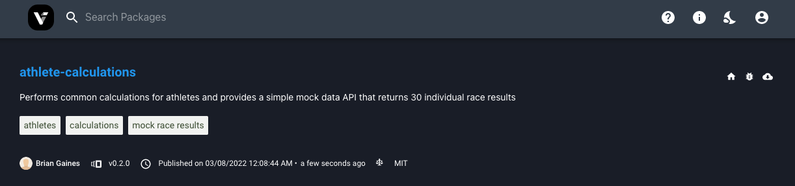
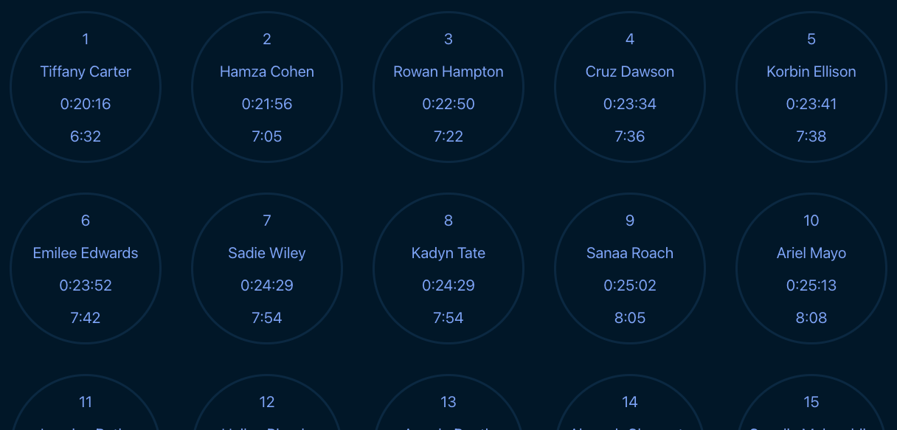

# athlete-calculations

## Overview

An NPM package that contains a variety of useful functions for the athlete and endurance activity.

## Installing and Using the Package 🚀

```bash
npm install athlete-calculations
```

## ESM (EcmaScript Modules)

This package uses ESM so you should be able to use a more modern approach to importing functions from this library.

```js
// ✅ Good
import { calculatePace } from 'athlete-calculations';

// 🟥 Bad ;)
const { calculatePace } = require('athlete-calculations');
```

## ✨ Cloning the Project and Working with the Codebase

```bash
git clone https://github.com/briang123/athlete-calculations

# Install Verdaccio globally so we can access it anywhere. This is our local NPM development server for when we want to test changes BEFORE we publish to NPM servers
npm install -g verdaccio

# If installing locally to run the code and make any changes, then run this command to setup the project
cd athlete-calculations/src && npm run contrib-setup
```

### Running Tests

Run the tests in the project

```bash
npm test
```

Run the tests in the project and allow Jest to watch for any changes so that tests can auto run after changes

```bash
npm run test:watch
```

### Build

We use `esbuild` to build a minified bundle and copied to the `dist` folder

```bash
npm run build
```

### Running Verdaccio

```bash
verdaccio
```

```bash
$ verdaccio
info --- Creating default config file in /Users/briangaines/.config/verdaccio/config.yaml
warn --- config file  - /Users/briangaines/.config/verdaccio/config.yaml
warn --- Plugin successfully loaded: verdaccio-htpasswd
warn --- Plugin successfully loaded: verdaccio-audit
warn --- http address - http://localhost:4873/ - verdaccio/5.7.0
```

### Publish

To our Development NPM Server (**Verdaccio**)

> Make sure to run the `verdaccio` command before the release to development

```bash
npm run release:dev
```

#### You might see this message

```bash
npm ERR! need auth This command requires you to be logged in to http://localhost:4873/
npm ERR! need auth You need to authorize this machine using `npm adduser`
```

If you do, then Login using the following command. You can see this by opening http://localhost:4873/ in a browser window.

```bash
npm adduser --registry http://localhost:4873/
# enter a username
# enter a password
# enter an email address
```

After you authenticate, head on over to the browser window and if you're not logged in already, go ahead and login. You may need to run `npm run release:dev` once more if you did need to login first. At this point, your developmentVersion in your `package.json` file will have been incremented 2x, which is fine.



Okay, you should be ready to test this out in your own test project. We'll just use a create-react-app CLI to show you the process, but you can choose your own project or framework to test with.

```bash
npx create-react-app hello-athlete &&
cd hello-athlete &&
npm install athlete-calculations --registry http://localhost:4873 &&
cd src
```

You should now have the package installed, so add code a page and give it a spin! _Scroll down for an example._



Go Live on the NPM Server (**NPM**)

```bash
npm run release:prod
```

## Formats

### Tokens

**The following format tokens are only available when calculating time or pace at this time.**

| Input | Example | Description      |
| :---- | :------ | :--------------- |
| %DD   | 01      | Days, 2-digit    |
| %D    | 1       | Days             |
| %HH   | 00-23   | Hours, 2-digit   |
| %H    | 0-23    | Hours            |
| %MM   | 00-59   | Minutes, 2-digit |
| %M    | 0-59    | Minutes          |
| %SS   | 00-59   | Seconds, 2-digit |
| %S    | 1-59    | Seconds          |

### Presets

**The following formatting presets are only available when calculating time or pace at this time.**

| Input     | Tokens                         | Example                               | Description                                                              |
| :-------- | :----------------------------- | :------------------------------------ | :----------------------------------------------------------------------- |
| DHMS-LLLL | %D %DL, %H %HL, %M %ML, %S %SL | 1 day, 2 hours, 9 minutes, 34 seconds | Long output of Days, Hours, Minutes, and Seconds                         |
| DHMS-llll | %D%Dl, %H%Hl, %M%Ml, %S%Sl     | 1d, 2hrs, 9min, 34sec                 | Short output of Days, Hours, Minutes, and Seconds                        |
| HMMSS     | %H:%MM:%SS                     | 2:09:34                               | Hour, Minutes (2-digit), Seconds (2-digit)                               |
| DHHMMSS-l | %D%Dl:%HH:%MM:%SS              | 1d:02:09:25                           | Short output of Days along with double-digit Hours, Minutes, and Seconds |

## Pace Calculator

### Calculate Pace

We can **calculate pace** from **time** and **distance**

```js
import { DISTANCE_UNITS, PACE_UNITS, calculatePace } from 'athlete-calculations';

calculatePace({
	distance: { traveled: 3.1, units: DISTANCE_UNITS.MILES },
	time: { hours: 0, minutes: 20, seconds: 21, units: PACE_UNITS.MILES },
	format: '%M:%SS', // ie. 'HMMSS' => '0:06:34' (using a preset)
})

// result
{
  "distance": "3.1 miles",
  "time": "0:20:21",
  "totalTime": {
    "days": 0,
    "hours": 0,
    "minutes": 6,
    "seconds": 34,
    "formatted": "6:34"
  }
}
```

### Calculate Time

We can **calculate time** from **distance** and **pace**

```js
import { DISTANCE_UNITS, PACE_UNITS, calculateTime } from 'athlete-calculations';

calculateTime({
	distance: { traveled: 3.1, units: DISTANCE_UNITS.MILES },
	pace: { hours: 0, minutes: 6, seconds: 34, units: PACE_UNITS.MILES },
	format: '%M:%SS', // ie. 'HMMSS' => '0:20:21' (using a preset)
});


// result
{
  "distance": "3.1 miles",
  "pace": "0:6:34",
  "totalTime": {
    "days": 0,
    "hours": 0,
    "minutes": 20,
    "seconds": 21,
    "formatted": "20:21"
  }
}
```

### Calculate Distance

We can **calculate distance** from **time** and **pace**

> NOTE: Currently, presets are not supported when calculating for distance.

```js
import { DISTANCE_UNITS, PACE_UNITS, calculateDistance } from 'athlete-calculations';

calculateDistance({
	distance: { units: DISTANCE_UNITS.MILES },
	time: { hours: 0, minutes: 20, seconds: 21 },
	pace: { hours: 0, minutes: 6, seconds: 34, units: PACE_UNITS.MILES },
})

// results
{
  "time": "0:20:21",
  "pace": "0:6:34 miles",
  "totalDistance": {
    "distance": 3.1,
    "units": "miles"
  }
}
```

## Fake Race Results Data API

We provide mock race results that contain 30 individual's 5K race results that you can use to test with your own development efforts. We also took the liberty of parsing the hours, minutes, and seconds from the race results to make it easier to get at the individual time parts. Feel free to use this data for testing pulling race results information and testing with your own codebase. _If you'd like to see any other mock data as part of the API, open an issue and provide a suggestion_.

```js
import { fake5kRaceResults } from 'athlete-calculations';

// A list of 30 race results
[
  {
    bib: 1,
    distance: 3.1,
    hours: 0,
    minutes: 20,
    name: 'Tiffany Carter',
    results: '0:20:16',
    seconds: 16,
    units: 'miles',
  },
  {
    bib: 2,
    distance: 3.1,
    hours: 0,
    minutes: 21,
    name: 'Tiffany Carter',
    results: '0:20:16',
    seconds: 56,
    units: 'miles',
  },
  //... removed for brevity
  {
    bib: 30,
    distance: 3.1,
    hours: 0,
    minutes: 29,
    name: 'Tiffany Carter',
    results: '0:20:16',
    seconds: 1,
    units: 'miles',
  },
];
```

### Example using the mock data with this package

```javascript
import { calculatePace, fake5kRaceResults } from 'athlete-calculations';

function fakeData() {
  return {
    fetch: () => fake5kRaceResults,
  };
}

function pace() {
  return {
    processResults: (data) =>
      data.map((resultItem) => {
        const { distance, units, hours, minutes, seconds } = resultItem;
        return {
          ...resultItem,
          pace: calculatePace({
            distance: { traveled: distance, units },
            time: {
              hours,
              minutes,
              seconds,
              units,
            },
            format: '%M:%SS',
          }).pace.formatted,
        };
      }),
  };
}

const faker = fakeData();
const fakeResults = faker.fetch();
const p = pace();
console.log(
  'Calculate pace and append to race results',
  JSON.stringify(p.processResults(fakeResults), null, 2),
);
```

## Folder and File Structure

It's understood that the structure of this project could change as we add more calculations and new functionality.

```
dist
src
 ┣ api
 ┣ core
 ┣ mock-data
 ┣ utils
 ┣ index.js
 ┣ package.json
 ┗ release.js
 test
  ┣ index.js
```

### dist

This is the folder where the released package bundle lives

### src/

- index.js - entry point
- release.js - script to help us manage releases to development and production

### src/api

We expose any public facing apis from this directory

- fake-data.js - public api providing fake data
- pace-calculator.js - public api providing all available functions related to pace the pace calculator

### src/core

- constants.js - It's preferred to use constants so we have meaning behind values that are being used
- format.js - All domain objects and functions related to formatting our data
- distance.js - Anything related to calculating distance
- pace.js - Anything related to calculating pace
- time.js - Anything related to calculating time

### src/mock-data

Any data that we want to return as part of our mock data api

### src/utils

- common.js - common household functions
- conversion.js - functions pertaining to converting values
- merge.js - functions pertaining to merging content together

### test

This directory's index file allows for us to test the package prior to releasing it as we've created an npm link to the package in the src directory (`npm run link-pkg`). This allows us to simulate testing from a separate project.

## Contributing

We welcome contributors to this package and ask that you're consistent with the coding style and attempt to keep the codebase DRY. Please report issues [here](https://github.com/briang123/athlete-calculations/issues).

## License

[MIT @ Brian Gaines](https://github.com/briang123/athlete-calculations/blob/main/LICENSE)
